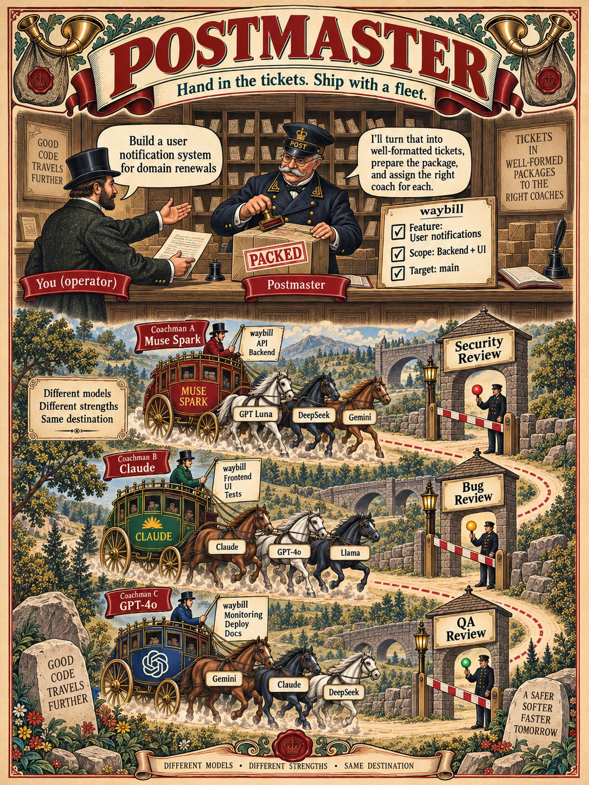

# postmaster

Get one ticket implemented by several models at once, then judged before it lands.



Two or more models implement the same ticket **independently, in separate worktrees, unable
to see each other's work**. A coachman combines what each got right, puts the result through
adversarial review rounds, and only then asks for a merge. Nothing lands on a green gate
alone: the merge word comes from a person, or from the supervising postmaster when the
config says it may.

## The three roles

| role | does | never does |
|---|---|---|
| **postmaster** | splits a stream into tickets, dispatches one coachman per ticket, supervises, answers escalations, grants merges | run a model lane, edit source |
| **coachman** | drives one leg of a ticket; five legs, each a fresh coachman, carry it from waybill to ship card with a written hand-off between them | take a second leg, merge on its own authority |
| **the team** | several lanes implementing the same ticket in blinkers | see each other's work |

## Why several models rather than one good one

Because they disagree usefully. Across a sample of runs, the synthesis took contributions
from **both** lanes every time: not "pick the winner", but one lane's mechanism plus the
other's test, wiring or edge case. And a second lane finding the same defect independently
is corroboration you can act on; a single lane agreeing with itself is not.

Disagreement is also diagnostic. When two lanes build the same mechanism and name it
differently, the project's own conventions did not decide it, and the coachman records the
gap as a proposed rule rather than flipping a coin the next run will flip again.

## Wiki

What the project has learned is in [`wiki/`](wiki/index.md), published with GitHub Pages, on
the LLM-wiki pattern: how harnesses really behave as against what their documentation says,
what the services the flow depends on actually do, why the design is shaped as it is, and
what happens when several models implement one ticket. That last is the founding question,
not the only subject.

Every run writes its full record — ledger, narrative, harness logs — to the project's own
`.postmaster/`, which is gitignored: those are that instance's business, not the tool's.
A record reaches [`raw/`](raw/README.md) only when somebody decides that run is evidence for
a claim, and `raw/` is local too. What gets published is what was **compiled**: counts,
outcomes, and the hash of the file each came from, never the evidence itself. So a standing
can be re-derived by whoever holds the evidence, and is a claim of provenance to everyone
else.

The claims above about combining models start there marked as claims, and the wiki grows one
record at a time. `skills/wiki` carries the three operations: ingest, query, lint.

## Getting started

Clone this repo and open your agent in it. There is no command to memorise and no wizard to
run: `AGENTS.md` tells the agent what to do, and the first time that is setting the machine
up with you, one question at a time (which agent CLIs fill which role, where tickets live,
where your projects are, who says the merge word). After that it helps you choose a project
and launches a postmaster.

```sh
scripts/probe-harnesses.sh      # which agent CLIs are installed
scripts/probe-trackers.sh       # which ticket sources are reachable
scripts/setup.sh --answers <file> # writes the config from the agent's collected answers (--keys lists them)
scripts/find-projects.sh        # your git projects, most recent first
scripts/check-target.sh  <path> # 0 usable · 1 not a repo · 2 dirty
scripts/discover-project.sh <path>
scripts/cut-scratch.sh <repo> <source-worktree> <dest> <commit>   # reviewer scratch, deps cloned
scripts/wait-for-markers.sh <dir> <glob> <count> <timeout>       # block until a round is in
scripts/log-action.sh <dispatch> <actor> <action> <target> …     # one JSON line per action
scripts/github.sh <repo> board|create|read|state|comment|list     # GitHub Issues on a Projects board
scripts/plane.sh create|read|state|comment|list …                  # Plane work items
scripts/launch.sh form|launch|resume <lane-or-role> …             # any lane or role, one command
scripts/runs-status.sh <run-root>                                  # the postmaster's poll
scripts/handoff-check.sh <handoff-file>                            # a leg may end only on exit 0
```

## What it needs

At least two agent CLIs that can run headless. Any git repository as a target. tmux, or
another way to keep a process alive between an agent's turns. Python 3.11 or newer, which
the scripts use to read the config, and jq for discovering a JavaScript project's gate. An agent that has loaded
`skills/postmaster/SKILL.md`: for a harness with a skills directory, symlink or copy
`skills/postmaster` into it; for any other, point the agent at the file.

**Tickets are GitHub Issues on a GitHub Projects board by default:** a kanban you can open,
with each ticket a card in the column its state says, and nothing to configure beyond `gh`
being logged in. Plane works the same way through its API, cloud or self-hosted. Any other
tracker your agent reaches through its own tooling is described once, outside this repo.
The adapters are in `skills/postmaster/trackers.md`.

**Nothing about a target project has to be configured.** The flow discovers the gate
command, the docs and the ticket convention. Ask only what discovery cannot answer.

## Native sessions

Only one process in the fleet is kept alive between turns: the postmaster, which the
user talks to, and that one needs a host that keeps an interactive process running
(tmux today). Everything else runs as a **native session**: the harness's own thread, in its
own store on disk. A lane or a coachman leg is launched headless, writes its events and a
marker, and exits. When it is needed again, for a ruling to a coachman or a remount of a
stalled lane, the flow resumes that thread with one command (`scripts/launch.sh resume`) and
the harness reloads the conversation itself.

That is cheaper than a pane per role. An idle interactive agent in a tmux or Herdr pane is a
process, its memory and often a network keepalive, doing nothing until someone types; two
concurrent runs with a coachman and two lanes each would hold six of them. An idle native
session is a file. The resume costs the tokens of reloading the thread, which prompt caching
mostly absorbs, and it leaves the harness's own record as the durable one.
`skills/postmaster/harnesses.md` says where each harness keeps its threads and how each is
resumed.

## Design rules

Nothing repo-specific in the flow. Nothing harness-specific outside an adapter. Anything
deterministic lives in `scripts/`, because prose is re-derived, and mis-derived, on every
run. Every count carries a control that could have come out otherwise. Every action a run
takes on a project is logged as a structured event, so what the flow did can be audited and
improved from the record rather than from the narrative.

See `AGENTS.md` for the full context, and `skills/postmaster/` for the runbooks
(`postmaster.md`, `coachman.md`) and the adapters (`harnesses.md`, `trackers.md`).
