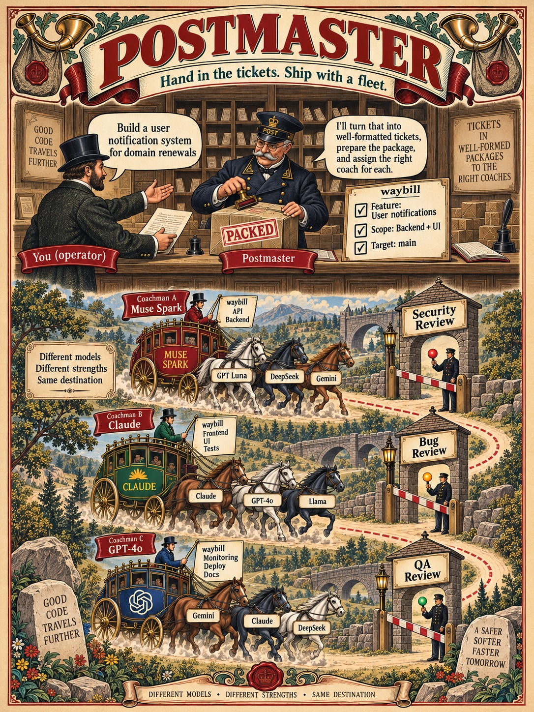

# postmaster

Get one ticket implemented by several models at once, then judged before it lands.



Two or more models implement the same ticket **independently, in separate worktrees, unable
to see each other's work**. A coachman combines what each got right, puts the result through
the adversarial review rounds its ticket names, and only then asks for a merge. Nothing lands on a green gate
alone: the merge word comes from a person, or from the supervising postmaster when the
config says it may.

## The three roles

| role | does | never does |
|---|---|---|
| **postmaster** | splits a stream into tickets, dispatches one coachman per ticket, supervises, answers escalations, grants merges | run a model lane, edit source |
| **coachman** | drives one leg of a ticket; up to three legs, synthesis, review and ship, each a fresh coachman, carry it from waybill to ship card with a written hand-off between them | take a second leg, merge on its own authority |
| **the team** | several lanes implementing the same ticket in blinkers | see each other's work |

## Why several models rather than one good one

Because they disagree usefully. Across a sample of runs, the synthesis took contributions
from **both** lanes every time: not "pick the winner", but one lane's mechanism plus the
other's test, wiring or edge case. And a second lane finding the same defect independently
is corroboration you can act on; a single lane agreeing with itself is not.

Disagreement is also diagnostic. When two lanes build the same mechanism and name it
differently, the project's own conventions did not decide it, and the coachman records the
gap as a proposed rule rather than flipping a coin the next run will flip again.

## Logging, auditing and tracing

These are first-class concerns in postmaster, designed in from the start rather than added
later. Several models change code in parallel, and nobody watches every step as it happens.
The record of what they did is how the work gets checked, and how the flow itself improves.

- **Every action is logged as it happens.** The postmaster and every coachman write one JSON
  line per action, to the run's own log and to the project's ledger. The actions come from a
  fixed set, so the log can be counted rather than read.
- **Every run can be traced from ticket to merge.** The waybill records what was dispatched.
  Each leg starts from the previous leg's written hand-off, and logs when it takes over and
  when it hands off. Each lane's event stream is kept with the run, along with the id of its
  harness thread. The ship card records what is proposed for merge and the evidence for it.
- **Nothing is reconstructed afterwards.** The narrative in `run-log.md` is for reading.
  Audits, and changes to the flow, work from the log.
- **Claims trace to evidence.** The [wiki](wiki/index.md) gives every claim a standing and
  cites the recorded runs and trials behind it.
- **Checks are scripts with controls.** Anything deterministic is a script, and every count
  comes with a control that could have come out the other way, so a passing check means
  something.

## Wiki

What the project has learned is in [`wiki/`](wiki/index.md), published with GitHub Pages, on
the LLM-wiki pattern: how harnesses really behave as against what their documentation says,
what the services the flow depends on actually do, why the design is shaped as it is, and
what happens when several models implement one ticket. That last is the founding question,
not the only subject.

Every run writes its full record — ledger, narrative, harness logs — to its own project's
`.postmaster/`, which is gitignored: that is the instance's business, not the tool's.
Promoting one into [`raw/`](raw/README.md) is a separate decision, and a decision to publish:
it happens after a scrub, only for a target that may be published, and only with what may
lawfully be redistributed. `raw/` is committed, so any claim can be followed to the record
behind it by anyone who clones the repository. A claim whose evidence could not be promoted
is not made.

The claims above about combining models start there marked as claims, and the wiki grows one
record at a time. `skills/wiki` carries the three operations: ingest, query, lint.

## Getting started

Clone this repo, open your agent in it, and say hi. Any first message starts the flow.
There is no command to memorise and no wizard to run: `AGENTS.md` tells the agent what to
do, and the first time that is setting the machine up with you, one question at a time (which
agent CLIs fill which role, where tickets live, where your projects are, who says the merge
word), and linking the skills into your agent CLIs so you can start from any project
afterwards. After that it helps you choose a project and is the postmaster in the session you
opened, or launches one when it cannot be.

```sh
scripts/probe-harnesses.sh      # which agent CLIs are installed
scripts/probe-trackers.sh       # which ticket sources are reachable
scripts/setup.sh --answers <file> # writes the config from the agent's collected answers (--keys lists them)
scripts/link-skills.sh [--dry-run | --check | --remove]            # the skills, as links into each CLI's skills folder
scripts/skill-refs.sh [--fix]                                      # every script path in the skill goes through <tool>
scripts/find-projects.sh        # your git projects, most recent first
scripts/check-target.sh  <path> # 0 usable · 1 not a repo · 2 dirty
scripts/discover-project.sh <path>                                # gate, docs, tracker and its prefix, and the checks
scripts/project-settings.sh inspect|report|ensure|write …        # optional project settings and their source
scripts/front-door.sh <harness> <model> <cwd> <yes|no> <target>   # self or spawn: who runs the stream
scripts/verify.sh checks|record|arm|run|results|summary …          # the checks a change is verified by
scripts/verify-examples.sh | verify-journey.sh | verify-library.sh # the defaults beyond the gate
scripts/cut-scratch.sh <repo> <source-worktree> <dest> <commit> [--clone <base>]  # reviewer scratch; --kind, --remove
scripts/wait-for-markers.sh <dir> <glob> <count> <timeout>       # block until a round is in
scripts/review-round.sh start|wait|teardown <dispatch> <round> … # a review round's deadline, its wait, its teardown
scripts/log-action.sh <dispatch> <actor> <action> <target> …     # one JSON line per action
scripts/tool-faults.sh harvest|comment|file|decline <dispatch> …  # a closed run's tool faults, as tickets
scripts/stage.sh <dispatch> <stage>                               # the one way a run changes stage
scripts/spec-review-link.sh <dispatch> <workhorse-worktree>        # resolve a reviewed spec's code-server link
scripts/spec-decisions.sh <dispatch> fresh|record|count           # record spec decisions, count approvals run-wide
scripts/run-times.sh <dispatch>                                   # how long each stage took, from the log
scripts/run-log.sh <dispatch> <text> | --section <title> | --close # the narrative, timestamped
scripts/run-meta.sh <dispatch> <repo> | path|check|release <dispatch> # run.json and the pinned tool a run started from
bun scripts/run-clash.ts <repo> <ticket-id>                      # refuse an id that already names a run or a branch
scripts/github.sh <repo> board|create|edit|read|state|comment|list|access|search # GitHub Issues on a Projects board
scripts/plane.sh create|edit|read|state|comment|list …             # Plane work items
scripts/local.sh <repo> store|create|edit|read|title|state|comment|list # tickets in the repo's git directory
scripts/tracker-kind.sh <repo>                                    # the tracker kind a repo uses: local when its store exists
scripts/ticket-check.sh <repo> <id> | --body <file> | --splice …   # a ticket's shape; --splice writes approved parts in
scripts/turnpikes.sh --list | resolve <text> | legs <dispatch>     # the turnpikes, and a run's legs
scripts/style-findings.sh list|count|gate|check <dispatch>         # a run's style findings, what its gate runs, the sort
scripts/launch.sh form|launch|review|resume|skill <lane-or-role> … # any lane or role, one command
scripts/reviewers.sh lines|eligible <lens>|lanes <waybill> <lens>|lenses # which lanes review under each lens
scripts/review-forms.sh has <harness>                            # whether the harness has a code-review form
scripts/review-findings.sh normalize|harvest …                   # native bug-review output into the finding contract
scripts/host.sh detect|name|run|stop|close|spawn|send|wait|read … # where a launch runs, and where you watch it
scripts/view-stream.sh < <events-file>                            # a harness's events, wrapped: what it says and runs, in full
scripts/runs-status.sh <run-root>                                  # the postmaster's poll
scripts/runs-watch.sh <run-root> [--timeout <seconds>]              # wait until a run needs the postmaster
scripts/handoff-check.sh <handoff-file>                            # a leg may end only on exit 0
scripts/wiki-lint.sh [--self-test]                                 # the wiki's rules, run not remembered
scripts/fixture.sh new|score|hidden …                              # a run on a fixture app, scored against a known outcome
```

A project may carry a `.postmaster/` folder. It holds the project's settings and every run's
full record — the ledger, the narrative, the cards, each lane's harness events stream and its
exported durable session — under `runs/`. Nothing in the folder is committed by default; it
carries its own `.gitignore`, so a checkout never brings another instance's ledgers, paths,
ticket text, harness sessions or choices. A project that has never been run against looks
exactly like one that has.

What a project may declare to everyone who works on it is one file, `.postmaster/project.toml`,
committed on purpose with `git add -f`: the checks that show a change works, the default
turnpikes, the tracker binding by name, and the risk surfaces. It names no credential, no
filesystem path, no machine name and no role assignment. This person's choices on this machine
— which lanes fill the roles — are in `.postmaster/settings.toml`, which never travels. The
shapes are `project.example.toml` and `settings.example.toml`. With neither file, the flow
discovers what it can and the agent conducts the rest in conversation: a missing settings file
is never an error and never a prompt to create one.

Precedence is stated once and followed everywhere: discovery supplies defaults; the shared
file declares what the project requires; local settings are this person's choices; the machine
config supplies what is machine-specific and is never overridden by a project. None of these
sets a floor of turnpikes: a ticket names the turnpikes its run passes through, and project
settings only say what `default` means for that project.

## What it needs

At least two agent CLIs that can run headless. Any git repository as a target. A session host
to watch the fleet in: [Herdr](https://herdr.dev) by default wherever it is running, where each
launch appears in its worktree's space under the project's, or tmux. With neither, launches run
in the background and the flow still works (`skills/postmaster/hosts.md`). Bun 1.4.2 or newer, which
runs the TypeScript scripts and reads the config, and jq, which the fixture flow requires.

## Installing the skills

Skills are installed as links, never as copies. `scripts/link-skills.sh` links each directory
under `skills/` into the user-level skills folder of every installed agent CLI that has one,
pointing at the main checkout of this repo, never a worktree. Setup checks their status first.
If links are missing, it shows the dry-run output and asks before installing them:

```sh
scripts/link-skills.sh --check      # report missing or blocked links; never changes anything
scripts/link-skills.sh --dry-run   # the links it would make, and anything in the way
scripts/link-skills.sh             # install, after the user agrees
scripts/link-skills.sh --remove    # remove them, and nothing else
```

It replaces nothing. A file, a folder or another link where a link belongs is named, and
nothing changes until you move it. `--check` is the read-only counterpart: it names any
missing or blocked link and the one command that installs them. Once linked, the postmaster skill (`/postmaster` in Claude
Code) works from any project, and finds this repo from its link. The folder each CLI reads is
in `skills/postmaster/harnesses.md`. A CLI with no folder there, agy for now, is pointed at
this repo's `skills/postmaster/SKILL.md` by its absolute path.

`skills/postmaster` runs the flow and is the one a dispatch needs. `skills/wiki` operates the
wiki, works in a checkout of this repo, and is only wanted by a session doing that. Each
directory is one skill; the other files beside a `SKILL.md` are its reference material, loaded
when its instructions send an agent to them rather than up front.

**Tickets are GitHub Issues on a GitHub Projects board by default:** a kanban you can open,
with each ticket a card in the column its state says, and nothing to configure beyond `gh`
being logged in. Plane works the same way through its API, cloud or self-hosted. With no
service and no login, the local kind keeps a repo's tickets in its own git directory, and
`scripts/local.sh <repo> list` shows them by state. Any other tracker your agent reaches
through its own tooling is described once, outside this repo.
The adapters are in `skills/postmaster/trackers.md`.

**Nothing about a target project has to be configured to run.** The flow discovers the gate,
docs and ticket convention. When a conversation settles a project decision that discovery cannot
answer, the agent offers the local settings file or the shared declaration and writes it only
with agreement. A missing file is never a prompt to create an empty one.

## Native sessions

Only one process in the fleet is kept alive between turns: the postmaster, which the
user talks to. A spawned postmaster needs a host that keeps an interactive process
running (Herdr or tmux); when the front-door session is the postmaster, that
conversation is the live process and needs no host of its own. Everything else runs
as a **native session**: the harness's own thread, in its
own store on disk. A lane or a coachman leg is launched headless, writes its events and a
marker, and exits. When it is needed again, for a ruling to a coachman or a remount of a
stalled lane, the flow resumes that thread with one command (`scripts/launch.sh resume`) and
the harness reloads the conversation itself.

That is cheaper than a pane per role. An idle interactive agent in a tmux or Herdr pane is a
process, its memory and often a network keepalive, doing nothing until someone types; two
concurrent runs with a coachman and two lanes each would hold six of them. An idle native
session is a file. The resume costs the tokens of reloading the thread, which prompt caching
mostly absorbs, and it leaves the harness's own record as the durable one.
`skills/postmaster/harnesses.md` says where each harness keeps its threads and how each is
resumed. On a host, each launch still gets a pane of its own while it runs, so the fleet can be
watched: the pane is a window onto a headless process that exits when it is done.

## Design rules

Project files are optional and discovery remains the default; they record only project decisions
discovery cannot infer. Nothing harness-specific outside an adapter. Anything
deterministic lives in `scripts/`, because prose is re-derived, and mis-derived, on every
run. Every count carries a control that could have come out otherwise. Every action a run
takes on a project is logged as a structured event, so what the flow did can be audited and
improved from the record rather than from the narrative.

See `AGENTS.md` for the full context, and `skills/postmaster/` for the runbooks
(`postmaster.md`, `coachman.md`) and the adapters (`harnesses.md`, `hosts.md`, `trackers.md`).
